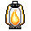
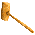
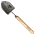
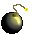
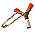
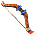
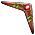
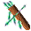
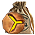

Personal resume and curriculum vitae page for:

### Gabriel Putnam

Live website can be accessed at: https://araesmojo-eng.github.io/

Changes (10/19/2025)

Bunch of change to support mini-games on the webpage with a style like the old 8-bit and 16-bit Zelda games with items that can be picked up and then interacted with on the webpage.

- Added items (lantern, gloves, mallet, shovel, bug net, bombs, bottle, slingshot, bow, boomerang, arrows, slignshot ammo)
  - , , , , , , , , , , , , , , , , 
- Added equipable storage (backpacks 1-5)
  - , , , , 
- Added item equiping and using
  - Item slots that appear with backpacks
  - Picking up items and storing them
  - Equiping and using an item
- Added animated item cursors (above list)
  - Basic cursor on equiping and using
  - Cursor upgrades with ammo changes (slingshot and bow)
  - Cursor change with activity (lantern, gloves)
- Added item uses on webpage (general categories, lantern, bow and arrow)
  - Lantern: burnable text, fuel that ligths on fire, interactive torches, interactive braziers
  - Gauntlet: pushable blocks( multi-step variety, and single click variety), liftable and placeable blocks
  - Mallet: breakable rocks, obstruction posts that can be hit into the ground
  - Bow/Arrow: Archery field with targets that can be shot to reveal items

Still have a lot of item uses, interactions, and effects to go through before even implementing much that's really complicated.
Currently just implementing test cases to make sure basic ideas are feasible using only CSS and no javascript.

Completed areas include:

***[Resume](https://araesmojo-eng.github.io/index.html#section_resume):***
- [Skills](https://araesmojo-eng.github.io/index.html#rsm_skills_trg)
- [Work](https://araesmojo-eng.github.io/index.html#rsm_work_trg)
- [Publications](https://araesmojo-eng.github.io/index.html#rsm_publications_trg)
- [Education](https://araesmojo-eng.github.io/index.html#rsm_education_trg)
- [Professional Awards](https://araesmojo-eng.github.io/index.html#rsm_prof_awards_trg)
- [Academic Awards](https://araesmojo-eng.github.io/index.html#rsm_academic_awards_trg)
- [Languages](https://araesmojo-eng.github.io/index.html#rsm_languages_trg)

***[Projects](https://araesmojo-eng.github.io/index.html#section_projects)*** (and skills documation with evidence)
- [Software](https://araesmojo-eng.github.io/index.html#prj_sftwr_trg)
  - [OpenGL](https://araesmojo-eng.github.io/index.html#prj_sftwr_opengl_trg)
    - (25) Twenty five example projects
    - Demonstrate moving from drawing a simple triangle to rendering a fully lighted scene, with:
      - Physics Based Rendering (PBR)
      - Irradiance Based Lighting (IBL)
      - Forward and deferred lighting
      - Particle systems
      - Signed distance field fonts (per Valve 2007)
      - Shadow mapping with directional, point source, and paraboloid shadow mapping.
    - Each has movies demonstrating the example project step with the accomplishments or features, in addition to downloads of a working EXE for Windows with resources (everything should be self contained and run in a minimal folder on a system with OpenGL)
  - [ShaderToy](https://araesmojo-eng.github.io/index.html#prj_sftwr_shadertoy_trg)
    - (2) Shaders demonstrating terrain erosion and reverse implementing the Unity skybox shader with modifications for dynamic sun, ground, and sky color along with pausing.
- [Math / Stats](https://araesmojo-eng.github.io/index.html#prj_math_trg) (mostly examples of hobby projects done for fun)
  - [Statistics of Magic the Gathering](https://araesmojo-eng.github.io/index.html#prj_math_mtg_stats_trg)
    - Set of 40+ charts on the state of the card game Magic the Gathering up until 2018.
    - Distribution trends for cards, card types, and keywords.
    - The value of various card traits in CMC with regression analysis.
    - Art examination with Perceptual Hash Analysis.
  - [Statistics of Star Trek](https://araesmojo-eng.github.io/index.html#prj_math_star_trek_stats_trg)
    - Set of 30+ charts discussion the Nielson ratings and user reviews (IMDB and TV.com) for Star Trek, with an emphasis on The Next Generation.
    - Looks at correlation of ratings to user reviews, along with character and setting appearances and how they individually or group rated with viewers.
    - Also shows director, teleplay writer, and story writer contributions and their individual averages, deviations, and total contributions.
  - [Statistics of Star Trek - DS9](https://araesmojo-eng.github.io/index.html#prj_math_star_trek_stats_ds9_trg)
    - Specifics about the show DS9 covered most of the ways I analyzed TNG, with updated methods based on some new ways of exploring the DS9 history with statistical graphing, grouping, and charting.
- [NASA](https://araesmojo-eng.github.io/index.html#prj_nasa_trg) (projects related to my prior work with NASA)
  - [ASMAT](https://araesmojo-eng.github.io/index.html#prj_nasa_asmat_trg) - Images, results, and video animations for CFD simulations of the Ares Scale Model Acoustic Test (ASMAT) at Marshall Space Flight Center Test Stand 116.
  - [Water Deluge](https://araesmojo-eng.github.io/index.html#prj_nasa_water_trg) - Orientation to the water deluge systems on NASA launch pads, with images, results, and video animations related to my work developing lagrangian particle methods for simulating 900,000 gallon per minute water deluge systems used with launch vehicles for vibration, heat, and blast wave suppression.
  - [Liftoff Debris](https://araesmojo-eng.github.io/index.html#prj_nasa_liftoff_debris_trg) Work done at Marshall Space Flight center on the Space Shuttle for examining Liftof Debris risks at launch.  Anything that liberated before the vehicle cleared the tower could be considered Liftoff Debris, including: facility rust, parts, and leftover equipment, along with vehicle ice, insulation, and other parts liberated at Liftoff.  Has an orientation to the Shuttle, debris generally, procedures handeled each flight, and the analysis methods used for Liftoff Debris specifically.
